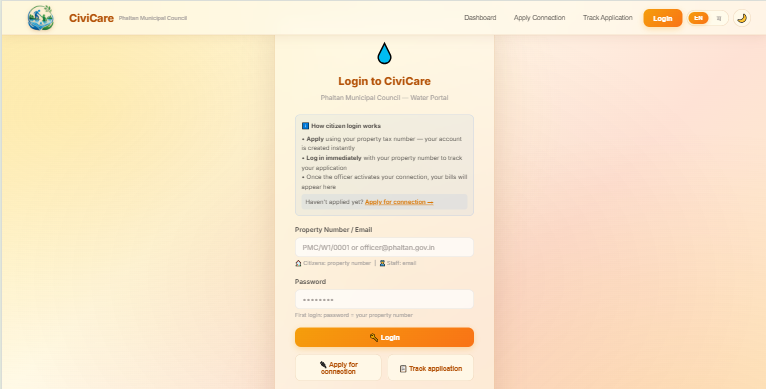
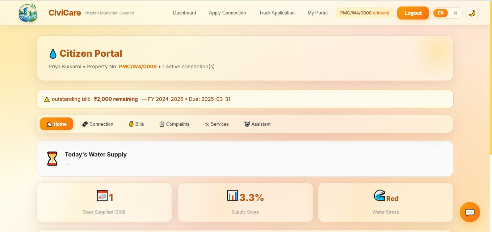

# 🚰 CiviCare

<p align="center">
  <b>AI-Powered Smart Water Governance & Grievance Management System</b><br>
  Empowering citizens and municipal authorities through digital governance.
</p>

---

## 📖 Overview

CiviCare is an AI-powered municipal water governance platform developed to simplify communication between citizens and municipal authorities.

The system enables citizens to report water-related issues, apply for new water connections, track complaint status, receive announcements, and interact with an AI chatbot. Municipal officers can efficiently manage complaints, monitor faults, generate bills, and make data-driven decisions through interactive dashboards.

This project was developed as a full-stack application using React, FastAPI, and PostgreSQL.

---

## ✨ Features

### 👨‍👩‍👧 Citizen Portal
- Secure Login
- Register Water Complaints
- Track Complaint Status
- Apply for New Water Connection
- AI Chatbot Support
- Download Bill Receipts
- View Municipal Announcements
- Speech-to-Text Complaint Filing

---

### 🏛️ Officer Portal

- Dashboard Analytics
- Complaint Management
- Water Supply Monitoring
- Fault Detection
- Billing Management
- AI-powered Announcement Generator
- SMS Notifications

---

### 🛠️ Plumber Portal

- View Assigned Complaints
- Update Complaint Status
- Field Work Management

---

### 🌍 Public Dashboard

- Water Supply Status
- Complaint Statistics
- Dam Information
- Public Announcements

---

## 🤖 AI Features

- 💬 AI Chatbot (Gemini API)
- 📄 Smart Bill Explanation
- 🔁 Duplicate Complaint Detection
- 🗣️ Speech-to-Text Complaint Registration
- ✍️ AI Announcement Suggestions

---

# 🛠️ Tech Stack

## Frontend

- React.js
- Vite
- JavaScript
- HTML5
- CSS3

## Backend

- FastAPI
- Python

## Database

- PostgreSQL

## APIs & Services

- Google Gemini API
- Twilio SMS API
- Cloudinary

---

# 📁 Project Structure

```text
CiviCare/
│
├── backend/
│   ├── app/
│   ├── requirements.txt
│   └── ...
│
├── frontend/
│   ├── src/
│   ├── public/
│   └── ...
│
├── README.md
├── SETUP.md
└── .gitignore
```

---

# ⚙️ Installation

Clone the repository

```bash
git clone https://github.com/dhanashri175/CiviCare.git
```

Move into the project directory

```bash
cd CiviCare
```

### Backend

```bash
cd backend

python -m venv venv

# Windows
venv\Scripts\activate

# Linux/macOS
source venv/bin/activate

pip install -r requirements.txt

uvicorn app.main:app --reload
```

---

### Frontend

```bash
cd frontend

npm install

npm run dev
```

---

# 🔐 Environment Variables

Create a `.env` file inside the **backend** folder and configure:

```env
DATABASE_URL=YOUR_DATABASE_URL
SECRET_KEY=YOUR_SECRET_KEY
GEMINI_API_KEY=YOUR_GEMINI_API_KEY
CLOUDINARY_CLOUD=YOUR_CLOUDINARY_CLOUD_NAME
CLOUDINARY_PRESET=YOUR_CLOUDINARY_UPLOAD_PRESET
TWILIO_ACCOUNT_SID=YOUR_TWILIO_ACCOUNT_SID
TWILIO_AUTH_TOKEN=YOUR_TWILIO_AUTH_TOKEN
TWILIO_PHONE_NUMBER=YOUR_TWILIO_PHONE_NUMBER
```

> **Note:** Never upload your `.env` file or real API keys to GitHub.

---

# 📸 Screenshots

> Add screenshots here after capturing the application.

| Login | Citizen Dashboard |
|-------|-------------------|
|  |  |


---

# 🚀 Future Enhancements

- 📱 Android Mobile Application
- 🌐 Multi-language Support
- 📍 GIS-Based Complaint Mapping
- 🔔 Push Notifications
- 📊 Advanced Analytics Dashboard
- 🤖 AI-Based Complaint Prioritization

---

# 📚 Documentation

Detailed setup instructions are available in:

**SETUP.md**

---

# 👩‍💻 Developer

**Dhanashri Pingale**

B.Tech Computer Engineering

GitHub: https://github.com/dhanashri175

---

# 📄 License

This project is developed for educational and academic purposes.

---

## ⭐ Support

If you found this project useful, consider giving it a ⭐ on GitHub.